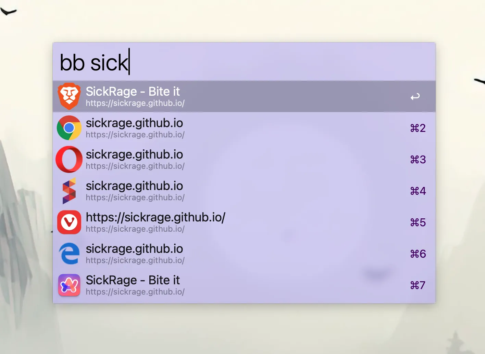
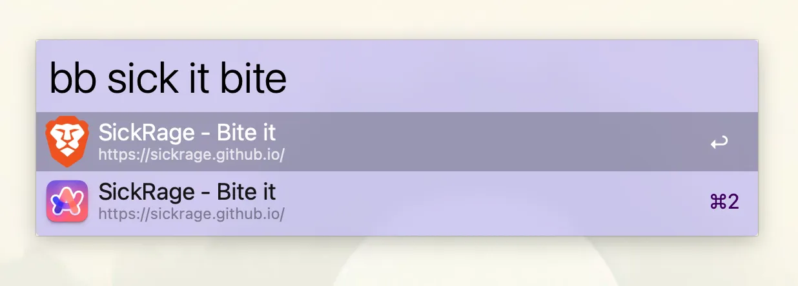

# Bookmark Search

[Download](https://github.com/danielb2/alfred-bookmark-search/releases)

This is a very small workflow to search bookmarks for chromium based browser. It makes use of Alfred features to be very efficient.
To search your bookmarks, use keyword `bb`

The icons used next to the url will indicate what browser the bookmark is stored with

## Why another?

The bookmark search workflow I used prior to writing this was written using PHP, which was not always installed on my computer, thus causing it to fail. For this bookmark search, I'm using ruby, an interpreter which ships with macos and thus will be present.

Unlike other bookmark searches, the order of words don't matter. 

 

